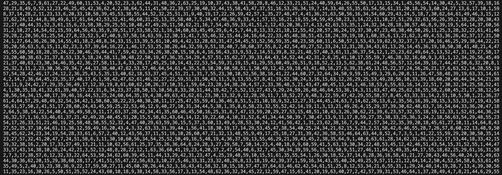

# better-random

An instrumental code for me to have a better code

## Idea

I know that https://random.org is NOT ideal random-ish approach to generate number, so when I need some number or sequence, I always increase a level of randomness.

Idea came into real usage after I realized that ChatGPT. ChatGPT suggested me proper NodeJS code, BUT its result ON UI was WRONG almost 60% of times (GPT generated me sequence with NOT all numbers, or generated a sequence with repeating numbers). So I decided to rely on MY code execution instead of ChatGPT's.

## Implementation

This code aimed to introduce a way how to generate a sequence of numbers which would be random but after many iterations.

To have ALL numbers from MIN_NUMBER to MAX_NUMBER inclusive, and that numbers NOT repeated and NOT skipped. Meaning that after sorting of such sequence oit would be 100% incremental sequence. In the code is used a [Fisher-Yates shuffle algorithm](https://en.wikipedia.org/wiki/Fisher%E2%80%93Yates_shuffle).

I iterate 1 mln times, and final result write into CSV file, so that I can easily copy column and paste in Google Spreadsheet document.

## Usage

Execute `npm test` to run a cycle from `1_000_000` iterations to make sure random value is really random.

Execute `npm start` to run a cycle from `1_000_000` iterations and write numbers into `./files/random_sequence.csv` after cycle finished.

Additional output may be logged into Terminal `stdout` but it then can slow down Terminal / VS COde / PowerShell / etc. which might be then stop responding.

## TODO

Code is stable, but not final - I have some other ideas around randomness.
